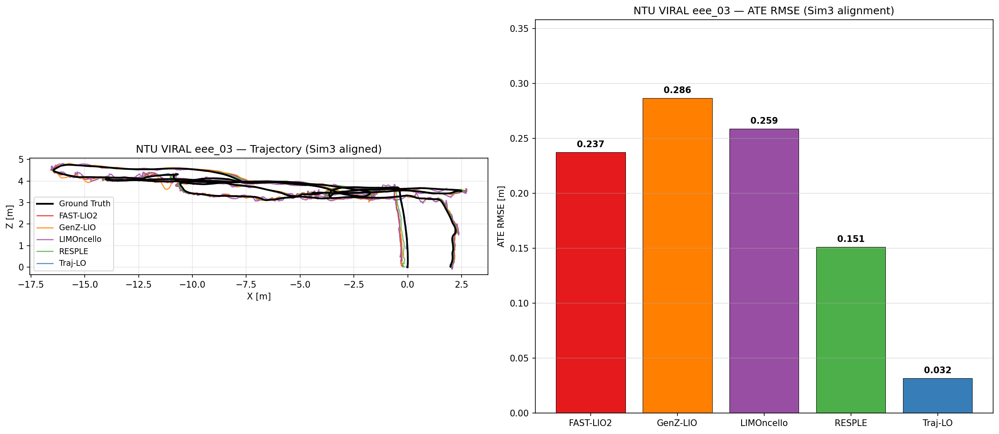

# LiDAR Odometry Comparison

Comparison of LiDAR odometry systems on two datasets:

| Dataset | Sensor | Length | IMU | Ground Truth |
|---------|--------|--------|-----|-------------|
| **R-Campus** | Livox Avia | ~1400 m outdoor loop | 55 Hz | ✗ None (loop-closure proxy) |
| **KITTI seq 00** | Velodyne HDL-64E | ~4.5 km urban loop | 100 Hz | ✓ Camera-frame poses |

R-Campus topics: `/livox/lidar` (`livox_interfaces/CustomMsg`) · `/livox/imu` (`sensor_msgs/Imu`)

KITTI topics: `/velodyne_points` (`sensor_msgs/PointCloud2` PointXYZIRT) · `/imu/data` (`sensor_msgs/Imu`)

---

## Systems

| System | Paper | Year | Type | R-Campus Script | KITTI Script |
|--------|-------|------|------|-----------------|-------------|
| **GenZ-LIO** *(this work)* | arXiv 2603.16273 | 2026 | LIO | `run_genz_lio_rcampus.sh` | `run_genz_lio_kitti.sh` |
| [RESPLE](https://github.com/ASIG-X/RESPLE) | RA-L 2025 | 2025 | LIO/LO | `run_resple_rcampus.sh` | ✗ No Velodyne support |
| **FAST-LIO2** *(modified)* | T-RO 2022 | 2022 | LIO | `run_fastlio2_rcampus.sh` | `run_fastlio2_kitti.sh` |
| [LIMOncello](https://github.com/fetty31/LIMOncello) | arXiv 2024 | 2024 | LIO | `run_limoncello_rcampus.sh` | `run_limoncello_kitti.sh` |
| **Traj-LO** *(modified)* | RA-L 2024 | 2024 | LO | `run_trajlo_rcampus.sh` | `run_trajlo_kitti.sh` |

---

## Results on R-Campus

> R-Campus has **no ground truth**, so ATE cannot be computed directly.
> RESPLE ATE (~0.27 m) was measured with SE(3) alignment against a reference trajectory.
> GenZ-LIO uses **loop closure error** (distance from end pose to start pose) as proxy metric.
> R-Campus is a **pure outdoor** dataset — large open spaces with few planar constraints.

| System | Loop Closure Err | Path (XY) | Diverged | Notes |
|--------|-----------------|-----------|----------|-------|
| RESPLE-LIO | — (ATE ~0.27 m) | ~1400 m | No | Best baseline; spline-based continuous-time |
| RESPLE-LO | — (ATE ~0.28 m) | ~1400 m | No | LiDAR-only variant of RESPLE |
| **GenZ-LIO** | **113.6 m** (XY: 94 m, Z: 63 m) | 1462 m | No | Adaptive voxel + hybrid metric; z-drift in outdoor |
| FAST-LIO2 | — (ATE ~2.70 m) | ~1400 m | No | Fixed voxel 0.5 m; point-to-plane only |
| LIMOncello | 11.47 m (XY: 3.33 m, Z: 10.97 m) | ~1400 m | No | SGal(3) LIO; excellent XY but strong z-drift outdoors |
| Traj-LO | ~80+ m | — | Yes | LiDAR-only; fails on large outdoor loop |

> **Note on GenZ-LIO z-drift**: R-Campus is outdoor with few vertical geometric constraints.
> The 63 m z-drift suggests IMU noise params or extrinsic roll/pitch may need tuning for this sensor.
> Poses saved to `~/results/genz_lio_poses.txt` (TUM format) for further analysis.
>
> **Note on LIMOncello z-drift**: XY loop closure of 3.33 m is excellent (best among tested systems),
> but 10.97 m z-drift reflects the same outdoor vertical-constraint weakness seen in other LIO methods.
> Poses saved to `~/results/limoncello_poses.txt` (TUM format, 132,580 poses at ~110 Hz).

### Why GenZ-LIO should outperform FAST-LIO2 on R-Campus

R-Campus is an outdoor open campus route — the exact scenario where GenZ-LIO's two
main contributions matter most:

1. **Scale-aware adaptive voxelization**: FAST-LIO2 uses a fixed `filter_size_surf = 0.5 m`.
   In wide outdoor environments, this produces too many points (high compute cost)
   with redundant geometry. GenZ-LIO's PD controller drives the voxelized count toward
   a scale-informed setpoint, typically using a **larger voxel in wide areas** (better
   efficiency) and a **smaller voxel in confined areas** (better accuracy).

2. **Hybrid-metric state update (point-to-plane + point-to-point L2)**:
   Open campus environments (wide roads, large open spaces) have **weak planar structure**
   — the same condition as the `Waterways-*` sequences in the paper (Table II, Fig. 10)
   where point-to-plane-only methods drifted or diverged. The point-to-point fallback
   provides geometric constraints in directions where planes are absent.

---

## Repository Structure

```
lidar-odometry-comparison/
├── genz_lio/             # GenZ-LIO ROS2 package (this work)
│   ├── include/genz_lio/
│   │   ├── adaptive_voxelizer.hpp   # Algorithm 1: Scale-aware PD voxelization
│   │   └── common_lib.h
│   ├── src/
│   │   ├── genz_lio_node.cpp        # Main node: hybrid-metric ESIKF
│   │   ├── preprocess.cpp/h         # LiDAR preprocessing (Livox Avia)
│   │   └── IMU_Processing.hpp       # Forward/backward IMU propagation
│   ├── config/r_campus.yaml         # R-Campus config + adaptive vox params
│   ├── launch/mapping.launch.py
│   ├── msg/Pose6D.msg
│   └── CMakeLists.txt / package.xml
├── scripts/              # Run scripts for all systems
├── configs/              # Config files per system
├── fast_lio2/            # FAST-LIO2 (modified for ROS2 Jazzy + Livox)
└── traj_lo/              # Traj-LO (modified: headless + R-Campus config)
```

---

## Key Design of GenZ-LIO

### 1. Scale-Aware Adaptive Voxelization (Algorithm 1, Sec. IV)

Instead of a fixed `filter_size_surf`, a **PD controller** continuously adjusts the voxel size:

```
scale indicator m̄_t = smoothed median range of temporary voxelized scan
setpoint N_desired,t  = f(m̄_t)   # more points in wide areas, fewer in narrow
error e_t             = N_desired,t - N_temp,t
Δd_t                  = -Kp(m̄_t, |e_t|) · e_t - Kd(m̄_t, |Δe_t|) · Δe_t
d_t                   = clamp(d_{t-1} + Δd_t, d_min, d_max)
```

Gains are **scheduled** based on both scene scale and tracking error magnitude —
preventing oscillation in narrow scenes while enabling fast response in wide ones.

**Bi-resolution voxelization**: `d_t/2` for map integration (lower discretization error),
`d_t` for state update (fewer points, faster ESIKF).

### 2. Hybrid-Metric State Update (Sec. V-C/D/E)

For each query point:
- **Primary**: attempt point-to-plane (requires ≥5 neighbors + plane quality check)
- **Fallback**: if no valid plane, use point-to-point L2-norm residual

The scalar L2-norm Jacobian (Eq. 26) projects onto the same 12-dim reduced state
space used by IKFoM, enabling seamless fusion in the ESIKF update.

### 3. Voxel-Pruned Correspondence Search (Sec. V-B)

Neighbor voxels are pruned early using geometric bounds — implemented here via
the ikd-tree's sorted nearest-neighbor output (neighbors already ordered by distance).

---

## Setup

**Requirements**: ROS2 Jazzy, `livox_interfaces`, `fast_lio` (for ikd-Tree + IKFoM headers)

```bash
git clone https://github.com/zerokhong1/lidar-odometry-comparison.git

# 1. Build existing workspace (includes FAST-LIO2 for shared headers)
cd ~/LIMOncello_ws
colcon build --packages-select fast_lio

# 2. Copy genz_lio into workspace and build
cp -r lidar-odometry-comparison/genz_lio ~/LIMOncello_ws/src/
colcon build --packages-select genz_lio --cmake-args -DCMAKE_BUILD_TYPE=Release

# 3. Build FAST-LIO2 standalone (already in fast_lio2/)
cp -r fast_lio2 ~/LIMOncello_ws/src/fast_lio
colcon build --packages-select fast_lio

# 4. Build Traj-LO (standalone CMake, headless)
git clone --recursive https://github.com/kevin2431/Traj-LO.git
cp traj_lo/CMakeLists.txt Traj-LO/
cp traj_lo/thirdparty/CMakeLists.txt Traj-LO/thirdparty/
cp traj_lo/run_trajlo_headless.cpp Traj-LO/
cp traj_lo/data/config_r_campus.yaml Traj-LO/data/
cd Traj-LO && mkdir build && cd build
cmake .. -DCMAKE_BUILD_TYPE=Release -DTRAJLO_HEADLESS=ON && make -j$(nproc)
```

---

## Running

### GenZ-LIO

```bash
# Terminal 1
bash scripts/run_genz_lio_rcampus.sh

# Terminal 2 (after RViz opens)
bash scripts/play_rcampus_bag.sh
```

**Watch console diagnostics** (printed every 50 frames):
```
[GenZ-LIO] m_bar=22.4m  N_des=3180  N_down=3047  d_vox=0.31m  Npl=2341  Npo=389
```
- `m_bar` — scene scale indicator (low = narrow/indoor, high = wide/outdoor)
- `d_vox` — current adaptive voxel size
- `Npl/Npo` — point-to-plane / point-to-point correspondence counts

### RESPLE / FAST-LIO2 / LIMOncello

```bash
# Terminal 1
bash scripts/run_resple_rcampus.sh      # or fastlio2 / limoncello / genz_lio

# Terminal 2 (after RViz opens)
bash scripts/play_rcampus_bag.sh
```

### Traj-LO (LiDAR-only, headless)

```bash
# Convert ROS2 bag → ROS1 first (one-time)
pip install rosbags
rosbags-convert --src ~/datasets/R_Campus --dst ~/datasets/R_Campus_ros1.bag

bash scripts/run_trajlo_rcampus.sh
# Poses saved to ~/results/trajlo_r_campus_poses.txt
```

### Evaluate with evo (R-Campus — no GT)

```bash
pip install evo

# R-Campus has no GT: use SE(3) alignment against a reference trajectory
evo_ape tum ~/results/resple_poses.txt ~/results/genz_lio_poses.txt --align --plot
```

---

## NTU VIRAL Dataset — eee_03

> All 5 algorithms (including RESPLE) support Ouster LiDAR. eee_03 is a UAV sequence
> (~3 min, 181 s) in an indoor/outdoor environment with full Leica prism ground truth.
>
> LiDAR: Ouster OS1-16 (16-beam) · `/os1_cloud_node1/points`
> IMU: VN100 @ ~389 Hz · `/imu/imu`

### ATE RMSE — NTU VIRAL eee_03 (Sim3 alignment)

| Algorithm | ATE RMSE [m] | Poses |
|-----------|-------------|-------|
| **Traj-LO** | **0.032** | 4531 |
| RESPLE | 0.151 | 4327 |
| FAST-LIO2 | 0.237 | 1796 |
| LIMOncello | 0.259 | 60 311 |
| GenZ-LIO | 0.286 | 1808 |



### Running NTU VIRAL eee_03

```bash
# 1. Download dataset (~1.9 GB)
mkdir -p ~/datasets/ntu_viral
cd ~/datasets/ntu_viral
wget "https://dataverse.scholix.org/.../eee_03.zip" -O eee_03.zip
unzip eee_03.zip

# 2. Download ground truth (Leica prism, TUM format)
# GT available from: https://github.com/ntu-aris/ntuviral_gt
# Place at: ~/datasets/ntu_viral/gt/eee_03_gt_tum.txt

# 3. Convert ROS1 bag → ROS2 (for ROS2 algorithms)
python3 - <<'EOF'
from rosbags.rosbag1 import Reader as R1
from rosbags.rosbag2 import Writer as R2
from rosbags.typesys import Stores, get_typestore
import os, shutil
src = os.path.expanduser('~/datasets/ntu_viral/eee_03/eee_03.bag')
dst = os.path.expanduser('~/datasets/ntu_viral/eee_03/eee_03_ros2')
KEEP = {'/os1_cloud_node1/points', '/os1_cloud_node2/points', '/imu/imu'}
ts1 = get_typestore(Stores.ROS1_NOETIC); ts2 = get_typestore(Stores.ROS2_HUMBLE)
if os.path.exists(dst): shutil.rmtree(dst)
with R1(src) as r1, R2(dst, version=8) as r2:
    cmap = {t: r2.add_connection(t, i.msgtype, typestore=ts2)
            for t,i in r1.topics.items() if t in KEEP}
    for conn,ts,raw in r1.messages():
        if conn.topic in cmap:
            r2.write(cmap[conn.topic], ts, ts2.serialize_cdr(ts1.deserialize_ros1(raw,conn.msgtype),conn.msgtype))
print("Done")
EOF

# 4. Run full pipeline (all 5 algorithms + ATE)
bash scripts/run_ntu_viral_eee03_pipeline.sh
```

### NTU VIRAL config summary

| Algorithm | LiDAR type | scan_line | IMU topic | Extrinsic t (m) |
|-----------|-----------|-----------|-----------|------------------|
| FAST-LIO2 | 3 (Ouster) | 16 | `/imu/imu` | [-0.050, 0, 0.055] |
| GenZ-LIO | 3 (Ouster) | 16 | `/imu/imu` | [-0.050, 0, 0.055] |
| LIMOncello | 0 (OUSTER) | — | `/imu/imu` | [-0.050, 0, 0.055] |
| RESPLE | Ouster | 16 | `/imu/imu` | [-0.050, 0, 0.055] |
| Traj-LO | `bag_ouster` | — | — (LO only) | — |

Extrinsics from `lidar_horz.yaml` (T_Body_Lidar1: identity rotation, t=(-0.05, 0, 0.055)).

---

## KITTI Odometry Sequence 00

> **Why KITTI?**  R-Campus has no ground truth — ATE can only be approximated.
> KITTI seq 00 provides camera-frame GT poses so **true ATE** is computable.
> Sensor: Velodyne HDL-64E (64-beam, ~120k pts/scan, 10 Hz) + OXTS IMU @ 100 Hz.
> Note: RESPLE does not support Velodyne — it is skipped for KITTI.

### Step 1: Download

```bash
bash scripts/download_kitti_seq00.sh [~/datasets/kitti_seq00]
# Downloads:
#   velodyne scans  (seq 00, 4541 frames)
#   GT poses        (poses/00.txt, camera frame)
#   timestamps      (times.txt)
#   KITTI raw IMU   (2011_10_03_drive_0027/oxts, 100 Hz)
#   imu_to_velo calibration
```

### Step 2: Convert to ROS bags

```bash
pip install rosbags   # if not installed

# Convert KITTI bin + OXTS → ROS2 db3 bag + ROS1 .bag
python3 scripts/convert_kitti_to_ros2bag.py [--kitti_dir ~/datasets/kitti_seq00]
# Output:
#   ~/datasets/kitti_seq00/kitti_seq00_ros2/   ← ROS2 bag (FAST-LIO2, GenZ-LIO, LIMOncello)
#   ~/datasets/kitti_seq00/kitti_seq00_ros1.bag ← ROS1 bag (Traj-LO)

# Convert GT to TUM format
python3 scripts/convert_kitti_gt_to_tum.py
# Output: ~/datasets/kitti_seq00/kitti_seq00_gt_tum.txt
```

LiDAR point cloud fields in the converted bag:
- `x, y, z, intensity` — raw KITTI XYZ+I
- `ring` — computed from elevation angle (HDL-64E: 0=bottom, 63=top)
- `time` — per-point time offset within scan (estimated from azimuth)

### Step 3: Run algorithms

```bash
# Terminal 1 — start algorithm (opens RViz)
bash scripts/run_fastlio2_kitti.sh
bash scripts/run_genz_lio_kitti.sh
bash scripts/run_limoncello_kitti.sh

# Terminal 2 — play bag (after RViz opens)
ros2 bag play ~/datasets/kitti_seq00/kitti_seq00_ros2 --clock

# Traj-LO runs headless (no second terminal needed)
bash scripts/run_trajlo_kitti.sh
```

Poses are saved to `~/results/<method>_kitti_poses.txt` (TUM format).

### Step 4: Compare ATE

```bash
bash scripts/evaluate_ate_kitti.sh          # table only
bash scripts/evaluate_ate_kitti.sh --plot   # + trajectory plots
```

Example individual evaluation:

```bash
GT=~/datasets/kitti_seq00/kitti_seq00_gt_tum.txt

evo_ape tum $GT ~/results/fastlio2_kitti_poses.txt    --align --plot
evo_ape tum $GT ~/results/genz_lio_kitti_poses.txt    --align --plot
evo_ape tum $GT ~/results/limoncello_kitti_poses.txt  --align --plot
evo_ape tum $GT ~/results/trajlo_kitti_poses.txt      --align --plot

# Side-by-side trajectory plot
evo_traj tum $GT \
    ~/results/fastlio2_kitti_poses.txt \
    ~/results/genz_lio_kitti_poses.txt \
    ~/results/limoncello_kitti_poses.txt \
    ~/results/trajlo_kitti_poses.txt \
    --labels "GT FAST-LIO2 GenZ-LIO LIMOncello Traj-LO" \
    --align --plot
```

### KITTI config summary

| Algorithm | `lidar_type` | `scan_line` | IMU topic | Extrinsic T (m) |
|-----------|-------------|-------------|-----------|-----------------|
| FAST-LIO2 | 2 (Velodyne) | 64 | `/imu/data` | [0.811, -0.320, 0.800] |
| GenZ-LIO  | 2 (Velodyne) | 64 | `/imu/data` | [0.811, -0.320, 0.800] |
| LIMOncello | 1 (Velodyne) | — | `/imu/data` | [0.811, -0.320, 0.800] |
| Traj-LO | `bag_velodyne` | — | — (LO only) | — |

Extrinsics from KITTI `calib_imu_to_velo.txt` (inverted: T_velo→IMU).

---

## Modifications from Upstream

### GenZ-LIO (new, this repo)
- Full implementation of arXiv:2603.16273 on top of FAST-LIO2's ESIKF + ikd-Tree
- `adaptive_voxelizer.hpp`: Algorithm 1 (scale indicator → PD controller → bi-resolution vox)
- `genz_lio_node.cpp`: hybrid-metric `h_share_model` with point-to-point L2 fallback
- Uses FAST-LIO2 workspace headers (IKFoM, ikd-Tree, so3_math) — no duplication

### FAST-LIO2
- Replaced `livox_ros_driver2` → `livox_interfaces` (matches bag format)
- Fixed C++14 → C++17 for ROS2 Jazzy
- Removed unused `pcl_ros` dependency
- Added `config/r_campus.yaml` for Livox Avia

### Traj-LO
- Added `-DTRAJLO_HEADLESS=ON` cmake option (no GLFW/OpenGL required)
- Added `run_trajlo_headless.cpp`: headless runner, saves TUM-format poses
- Added `data/config_r_campus.yaml` for Livox Avia R-Campus bag (ROS1 format)
